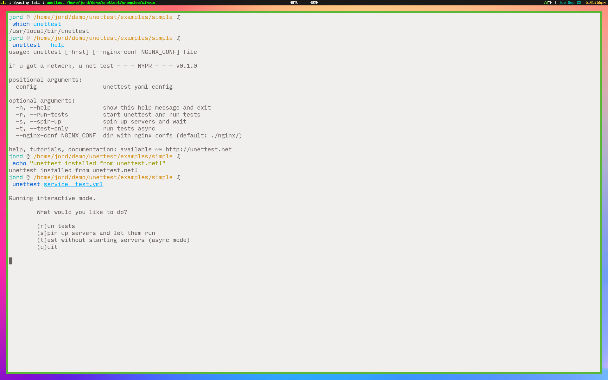
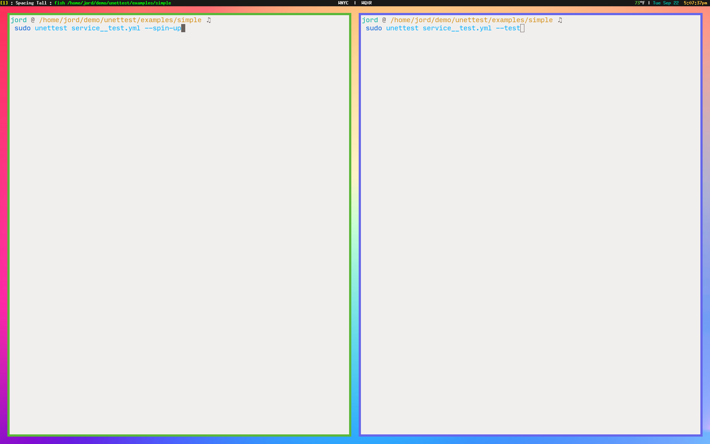
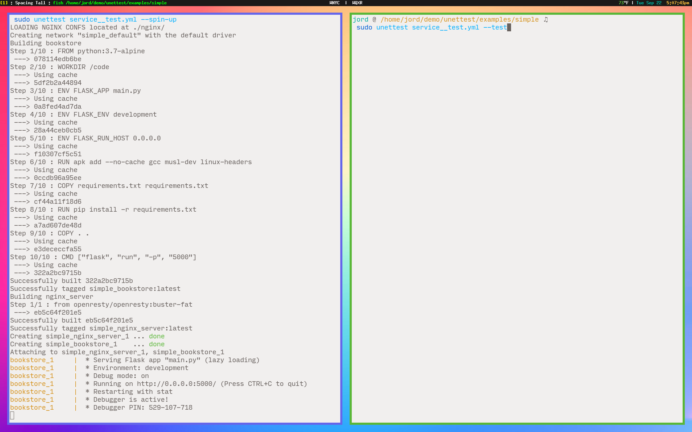
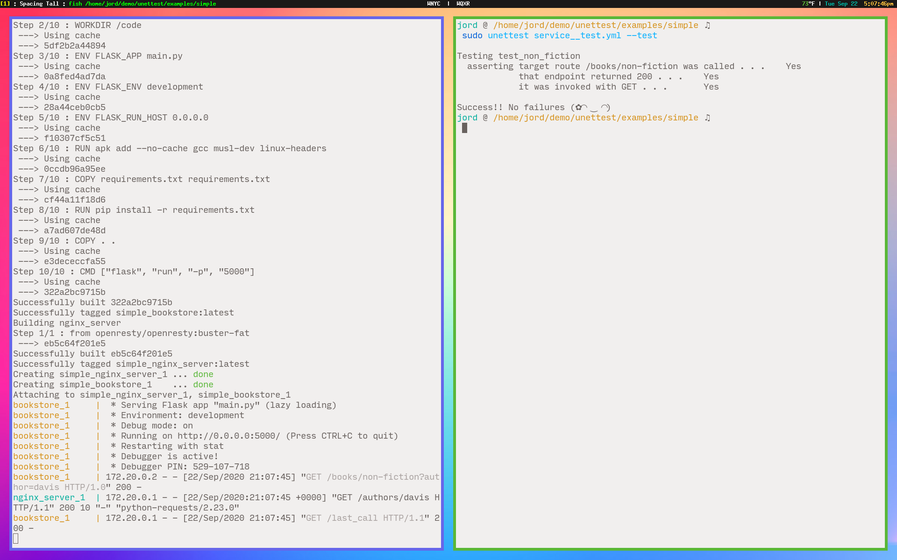
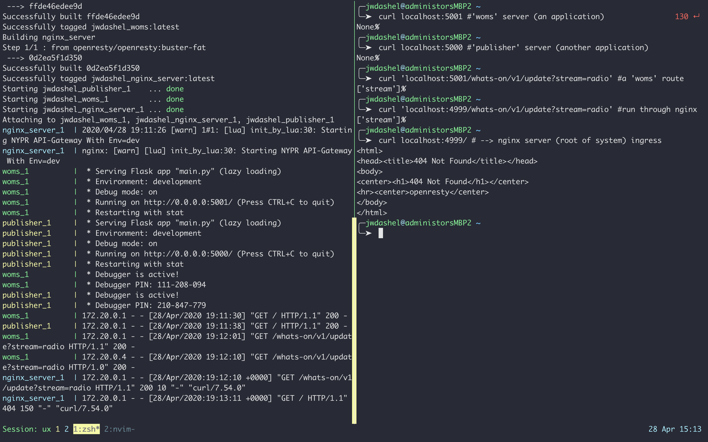

==========
 Tutorial
==========

How to Work With NGINXRAY
-------------------------

I think it will be easiest to show how to use NGINXRAY with terminal screen sessions.
It'll reveal how to think with NXR most directly.

Setup
^^^^^

You must first acquire NGINXRAY. You can get a copy here:

* `MacOS <https://nginxray.s3.us-east-2.amazonaws.com/nginxray.mac>`_
  (`SHA-256 checksum <https://nginxray.s3.us-east-2.amazonaws.com/mac-sha256>`_)

Add it to your path (``/usr/local/bin/`` is an option). You can use it as it or give it a
snappy alias.

Ready
^^^^^

You can cue up two terminals and run this in a sort of server/client mode.

Set
^^^

Firing off the left-side NGINXRAY with ``-s``, to "spin" up the servers and let them go.

Go
^^

Firing off the right-side NGINXRAY with a ``-t`` to run the "tests".

See how the contents of those tests are reported in the logs on the left. Super easy to
develop with! Like shining a flashlight in a dark corner.

Tests
^^^^^

.. image:: tutorial_photos/4testconfig.png

This is the logical structure of the systems under test and the tests excercising their
functionality.

A Network REPL!
^^^^^^^^^^^^^^^

You can work with any number of services like a REPL. You can access a service directly (I
would consider this going "around") or through the NGINX server being run by NGINXRAY.
